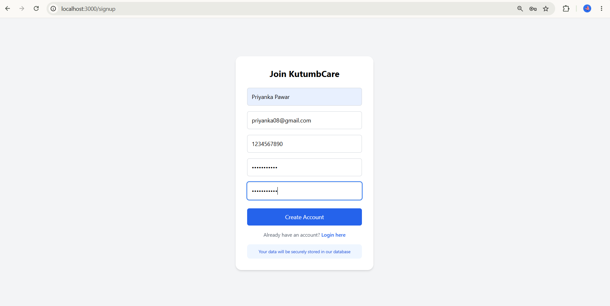
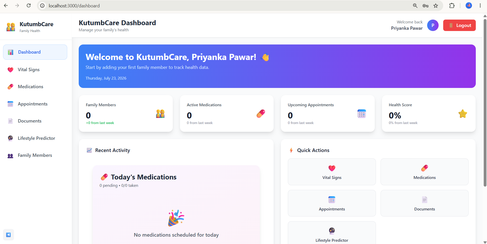

# KutumbCare - Family Health Management System (Frontend)

KutumbCare is a holistic healthcare platform for families to **monitor, manage, and enhance overall health and well-being**.  
This repository contains the **frontend** of the KutumbCare application, built with **React, TypeScript, Tailwind CSS, and Recharts**.

---

## 🛠 Features

- **User Authentication**  
  - Login and Signup pages with form validation.  

- **Dashboard**  
  - Family overview with member cards.  
  - Health summary cards (medications, vitals, appointments).  
  - Trend charts for vitals using Recharts.  

- **Profile Management**  
  - View and edit personal and family health details.  

- **Medical Records**  
  - List and upload prescriptions, lab reports, and other records.  

- **Medications & Vitals**  
  - Track medications and vitals for each family member.  
  - Add new medications and vitals.  

- **Theme Support**  
  - Light and dark mode toggle using ThemeContext.  

- **Reusable Components**  
  - Card, Chart, Button, Input, Navbar, Sidebar, etc.  

- **Utilities & Formatters**  
  - Date, time, number, blood pressure, and other health data formatting.  

---

## 💻 Tech Stack

- **Frontend:** React, TypeScript  
- **Routing:** React Router DOM  
- **State Management:** React Context API (AuthContext & ThemeContext)  
- **Styling:** Tailwind CSS  
- **Charts:** Recharts  
- **HTTP Requests:** Axios  

---

## 📁 Folder Structure

src/
├── components/ # Reusable UI components
│ ├── Card.tsx
│ ├── Chart.tsx
│ ├── Navbar.tsx
│ └── Sidebar.tsx
├── context/ # Global state contexts
│ ├── AuthContext.tsx
│ └── ThemeContext.tsx
├── pages/ # Application pages
│ ├── Auth/
│ │ ├── Login.tsx
│ │ └── Signup.tsx
│ ├── Dashboard/
│ │ └── Dashboard.tsx
│ ├── Profile/
│ │ └── Profile.tsx
│ ├── Records/
│ │ ├── RecordsList.tsx
│ │ └── UploadRecord.tsx
│ ├── Medications/
│ │ ├── MedicationList.tsx
│ │ └── AddMedication.tsx
│ └── Vitals/
│ ├── VitalsList.tsx
│ └── AddVitals.tsx
├── routes/
│ └── AppRoutes.tsx
├── services/ # API service calls
├── utils/ # Formatters and validators
│ └── formatters.ts
└── styles/
└── index.css


---
## 📸 Screenshots

### Authentication
| Login | Signup |
|---|---|
|  |  |

### Dashboard


### Family Members
| Add Member | Member Form | Member Profile |
|---|---|---|
|  |  |  |

| Member Deletion |
|---|
|  |

### Vital Signs
| Vital Form | Vital Added |
|---|---|
|  |  |

### Medications
| Medication Dashboard | Medication Form |
|---|---|
|  |  |

| Medication Profile | Medication Added |
|---|---|
|  |  |

### Appointments
| Appointment Form | Appointment Added |
|---|---|
|  |  |

| Appointment Profile |
|---|
|  |

### Medical Documents
| Document Form | Document Added |
|---|---|
|  |  |

## ⚡ Installation

1. Clone the repository:

```bash
git clone https://github.com/yourusername/kutumbcare-frontend.git
cd kutumbcare-frontend


Install dependencies:

npm install


Start the development server:

npm start


The app should now be running at http://localhost:3000
.

🔧 Configuration

API requests are handled via src/services/api.ts.

Theme is managed with ThemeContext.tsx.

Tailwind CSS is pre-configured in src/styles/index.css.

📈 Future Enhancements

Connect frontend to backend API for live data.

Add notifications and reminders for medications & appointments.

Integrate charts for multiple vitals per family member.

Improve responsiveness and accessibility.


---

